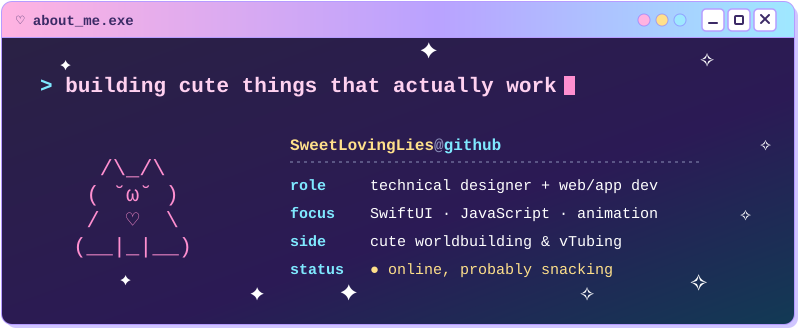
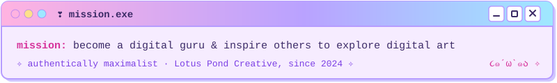
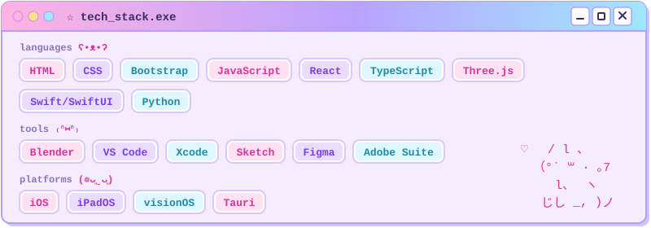
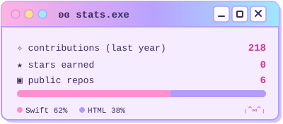
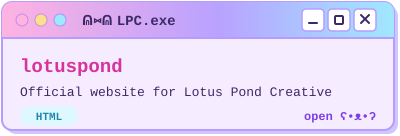
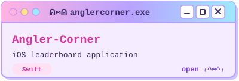
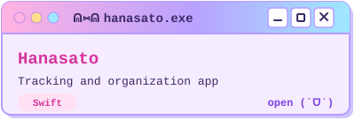
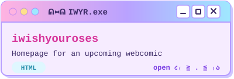

<table>
<tr>
<td width="400" valign="top"></td>
<td width="400" valign="top"> </td>
</tr>
</table>

<table>
<tr><td></td><td></td></tr>
<tr><td></td><td></td></tr>
</table>

<a href="https://lotuspondcreative.com">lotuspondcreative.com</a>

